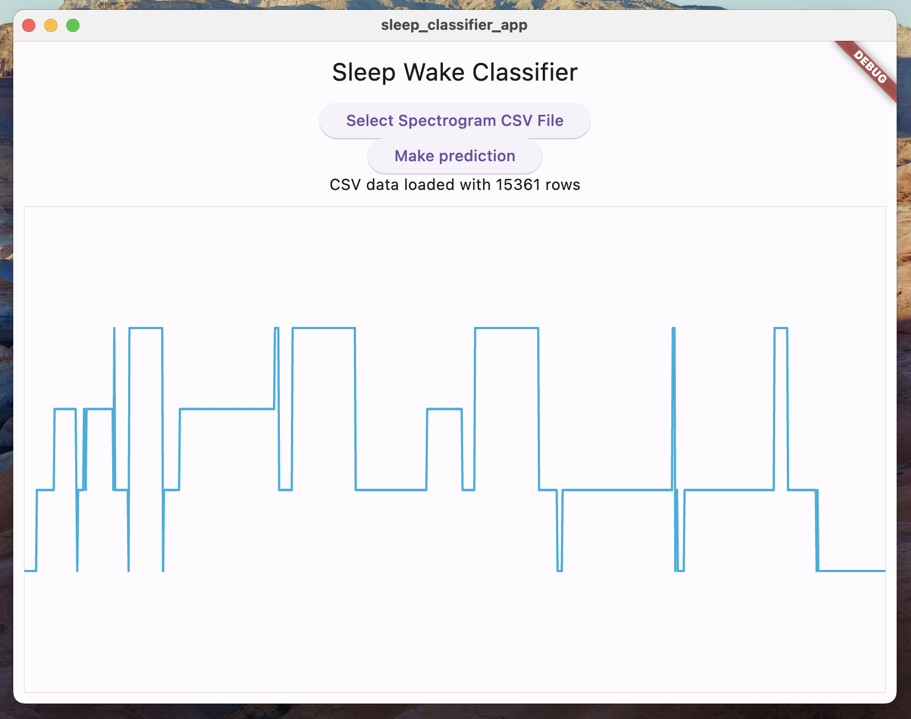

# sleep_classifier_app

This Flutter app runs a TFLite model on CSVs of spectrogram data. The spectrogram should be derived from accelerometer data (re)sampled at 32 Hz. See [the original model's page](https://github.com/MADSOLSEN/SleepStagePrediction), and Arcascope's [pisces project](https://github.com/Arcascope/pisces) for more information about creating this model, [finetuning it on Apple watch data](https://github.com/Arcascope/pisces/pull/9) co-recorded with PSG, and more.

## Getting Started

1. You will need Flutter 3.19.6+, and to follow some [start up directions with `tflite_fltuter`](https://pub.dev/packages/tflite_flutter). Specifically, you'll need to [build the TensorFlow C library](https://www.tensorflow.org/lite/guide/build_cmake) and add them to the appropriate per-platform projects.
2. You will also need some high-resolution accelerometer data, at least 32 Hz is recommended. Apple Watch data works great, as will data from other high-quality consumer wearable spectrograms.
3. Use the preprocessing in [Arcascope's Pisces TensorFlow model class preprocessing functions](https://github.com/Arcascope/pisces/blob/4575317c23b6e63dfc22657fac286bfdba251d34/pisces/models.py#L398) to transform this accelerometer data into spectrograms. 
4. Each accelerometer recording yields a stacked spectrogram of shape `(1, 15360, 32, 2)`; save the sub-tensor `spectro[0, :, :, 0]` of shape `(15360, 32)` as a CSV with 32 columns.
5. Compile the app for your platform, load the CSV, and see the predicted sleep stage be plotted.

## Model weight licensing.
The saved model weights from our finetuning are available in `assets/`; these are distributed under the same license as this repository, and were derived from the [orignal open weights](https://github.com/MADSOLSEN/SleepStagePrediction/tree/master/models/pretrained_weights), as [shared in 2022](https://github.com/MADSOLSEN/SleepStagePrediction/commit/05d2d6e5a560e9dd53e5af4a6c39a6c2f30d9ff8).